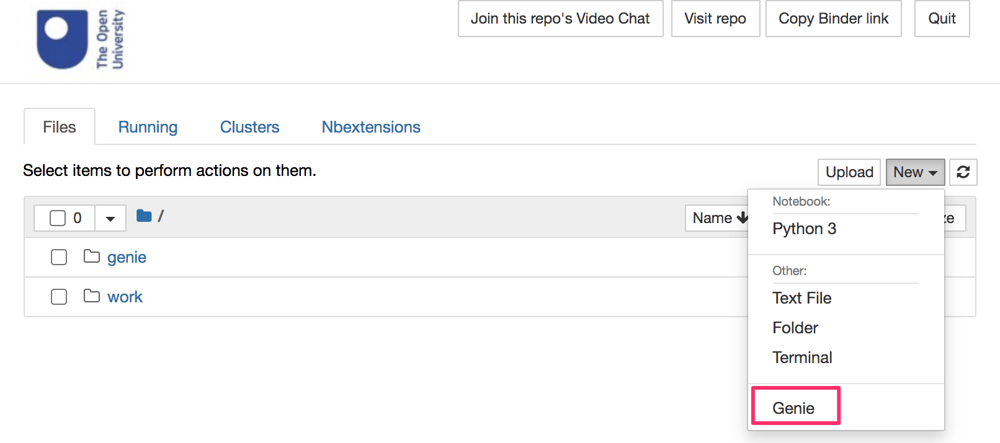

# ou-s397-unoffical
Unofficial container for OU Module S397.

This builds on the officially released container by adding a Jupyter server to it it.

You can access the Genie application used in the course via the notebook homepage New menu:

View using MyBinder: 

## Getting Started
You can explore the contents of this repository via interactive Jupyter notebooks by clicking the *Binder* button above.

To run the environment on your own computer, you need to do the following:

- install Docker onto your computer; you can download the installation files from the Docker website: [Get Docker](https://docs.docker.com/get-docker/)

- open a terminal / command prompt in your desktop; from the command prompt, do the following:
  - create a working directory / folder to work in by entering the command: `mkdir S397`;
  - change directory into that fold by running the command: `cd S397`;
  - on a Mac at least, launch the docker container by running the command: `docker run --name s397test -p 8397:8888 -v "$PWD:/home/jovyan/notebooks"  -e JUPYTER_TOKEN="letmein" ousefuldemos/ou-s397-unofficial:latest`
  - *(the quotes round the volume mount cope with spaces in the `$PWD` directory path)*
  - stop (hibernate) the container with the command: `docker stop s397test`
  - restart the container with the command: `docker restart s397test`
  
*Windows users may need a slightly different syntax for the `docker run` command; if you can help me debug Windows run commands, that would be very helpful:-)*

When you run the `docker` command, several things will happen:
 
 - first, docker will download the container image from DockerHub (this may take some time but only happens the first time you try to run the container);
 - then, docker will launch the container and a Jupyter notebook server will start running inside it.
 
When the container is running, go to [`localhost:8397`](http://localhost:8397) in your browser (if that doesn't work, try [`127.0.0.1:8397`](http://127.0.0.1:8397)) and you should see a running notebook server there.

Use the token `letmein` to access the server (you should only need to do this once).
 
Any files in the local `S397` directory on your host computer should appear in the `notebooks` folder in the notebook homepage directory listing.

